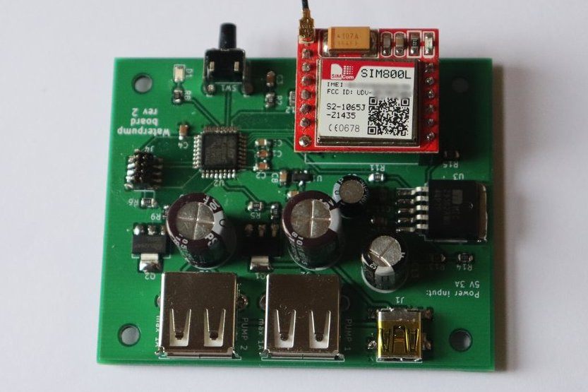

# Waterpump

**This is an ongoing project so do not expect everything to work !**



This project is an automatic system for watering plants. Everyday, pumps are switched on for a few seconds to provide enough water to some plants. The device can be controlled by sending SMS to change the schedule or water plants. In addition, a small push-button is present to water plants immediately.

## Build and flash instructions

First of all, you need to install the [ARM embedded toolchain](https://developer.arm.com/tools-and-software/open-source-software/developer-tools/gnu-toolchain/gnu-rm) and [JLink Software and Documentation Pack](https://www.segger.com/downloads/jlink/#J-LinkSoftwareAndDocumentationPack).

There are two types of build: release and debug.

To build the project, run one of these commands:
```
$ make                  # BUILDTYPE set to release
$ BUILDTYPE=release make
$ BUILDTYPE=debug make
```

Connect the board to a SEGGER debug probe and run these commands to flash or debug the firmware:
```
$ make flash-target                 # Flash release firmware
$ BUILDTYPE=debug make flash-target # Flash debug firmware
$ BUILDTYPE=debug make debug-target # Start debugging firmware
```

## Building hardware

In `hardware` folder, there are Gerber files sent to [JLCPCB](https://jlcpcb.com/) for each revision of the board. I recommend that you build the latest revision of the board. Components can be bought on [RS online](https://uk.rs-online.com/web/).

### Issues with rev1 board

  * SIM800L Footprint is incorrect
  * No mounting holes
  * micro USB connector is too far away from the side of the board
  * Power circuit for SIM800L is not working properly. Large polarized capacitors are missing on the input and output of the LDO voltage regulator. The regulator is not able to handle load transients fast enough, causing the SIM800L to brown out.

### Issues with rev2 board

  * SIM800L footprint is still incorrect ! Although it is easier to insert the module in pin headers than on rev1.
  * micro USB connector should be replaced by a barrel connector because USB cables should not be used to provide 3A.

## Power requirements

The GSM module can use up to 2A and each pump should not use more than 1A due to the choice of MOSFET transistors (especially on rev 2).
For this reason, I recommend powering this board with a 5V 3A power supply. Alternatively if you are using only 2.5W pumps, a 5V 2.5A can be used.

## Switching on water pump

Both pumps are switched on in sequence for 3 seconds each if the push button is pressed or if the GSM modules receives a text message starting with "WATER ALL". If you only want to enable pump 1 or 2, send text message "WATER 1" or "WATER 2".

## SMS commands

| SMS | description | examples |
| --- | ----------- | ------- |
| WATER <pump_index> | Turn on , | "WATER 1" |
| WATER ALL | Turn on both pumps | "WATER ALL" |
| SCHEDULE <index> STOP | Disable | "SCHEDULE 1 STOP" |
| SCHEDULE <index> <hour>:<min>:<sec> ALL | Turn on | "SCHEDULE 0 19:04:57 ALL" |
| SCHEDULE <index> <hour>:<min>:<sec> <pump_index> | Turn on a pump once per day | "SCHEDULE 1 06:43:00 1" |
